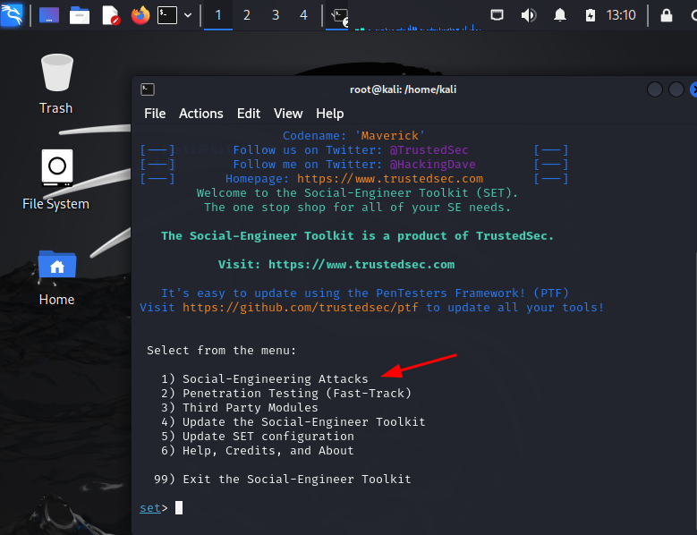

# Phishing para capturar senha de uma pagina da internet
Usaremos o site do ``` Facebook ``` como exemplo. 

### Ferramentas utilizadas:

- Kali Linux (https://www.kali.org/)
- Setoolkit (Ferramenta pré-instalada no Kali Linux)

### Pontos Importantes:
 - Caso esteja usando uma VM, certifique-se que a configuração da rede esteja no modo: Bridged Adapter(Inglês) ou Placa de modo Bridge(Português).
 - Funcionará para os dispositivos na mesma rede.
 - Ao clonar a pagina deve ser clonado a pagina onde digita o login e senha.

### Resumo (Passo-a-passo): Configuração da ferramenta setoolkit para construção do Phishing no Kali Linux:

 - Acesso root: sudo su
 - Iniciando o setoolkit: setoolkit
 - Tipo de ataque: Social-Engineering Attacks
 - Vetor de ataque: Web Site Attack Vectors
 - Método de ataque: Credential Harvester Attack Method 
 - Método de ataque: Site Cloner
 - Obtendo o endereço da máquina: ifconfig
 - URL para clone: http://www.facebook.com
 - Enviar o IP da maquina para alguém

### Detalhamento (Passo-a-passo): Configuração da ferramenta setoolkit para construção do Phishing no Kali Linux:

01 - Acesso root no modo administrador: aplicar o comando ``` sudo su ```, em seguida vai pedir para digitar a senha do administrador.


02 - Em seguida, iniciar a ferramenta ``` setoolkit ``` com o comando: setoolkit. Ao acessar pela primeira vez, vai solicitar para aceitar os termos da ferremanta. Então, digite YES.


03 - Vai abrir a ferramenta com as opção, portanto, selecione a opção: ``` 01) Social-Engineering Attacks ```. 



04 - Seguindo com as configurações, selecione: ``` 2) Web Site Attack Vectors ```.


05 - Agora, selecione a opção: ```3) Credential Harvester Attack Method ```.


06 - Mais uma configuração, selecionar a opção: ``` 2) Site Cloner ```.


07 - Para seguir com a configuração, neste passo, a ferramenta identifica o IP que está rodando. O ``` Setoolkit ```, vai usar essa maquina como um servidor receber o login e senha rackeada. Então, mantém como está é apenas clicar no botão ``` Entrer ```. Você vão perceber que vai apresentar o o IP da maquina na tela.


08 - Nesta opção, digitar a URL que irá clonar, no nosso exemplo é o: ``` http://www.facebook.com ```.


09 - Após clicar no entrer, a configuração está pronta e aguardando alguém clicar e tentar logar no Facebook. Na tela, fica desta forma, aguardando.


10 - Enviar para alguém o IP que aparece no setimo passo, que é o IP da maquina.

### Resultados
Após alguém realizar o login e senha, a tela de comando apresentará alguns textos. Mas em alguma linha dessas vai mostrar conforme a imagem abaixo, com a captura.


